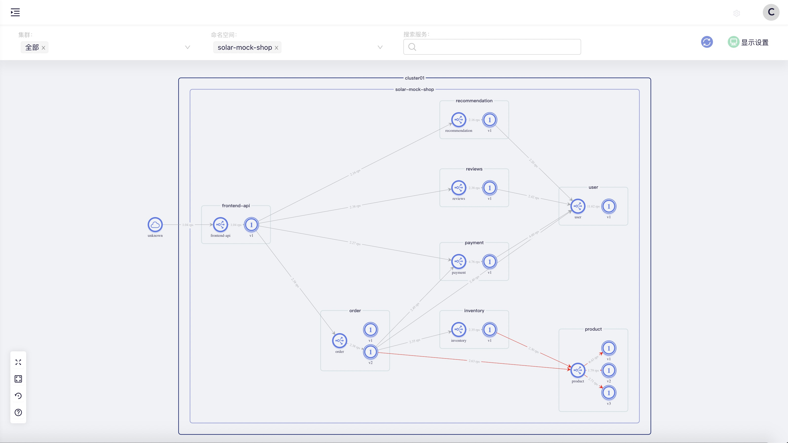

# Mockservices

Mockservices is an all in one app that build for testing Microservices on BareMetal, Docker, Kubernetes, or Service Mesh, the key features of this app is that you can deploy as many apps as possible with just a single binary file or docker image, then you can get hundreds or thousands microservices for testing. You can specify any to any HTTP request. e.g. starting two apps named order and product, sending HTTP requests from order, you will get a mock response. 

As for the Service Mesh testing, sometimes we want to do fault injection to the app which response the real error code, all you have to do is set specific headers, you will get the result.

| Header   |      Description      |  Example |
|----------|:-------------|:------|
| fi-app | The app name | product  |
| fi-ver | The app version, it is optional   |   v1 |
| fi-code | Response code |    503 |
| fi-delay | Response with delay in millisecond |  1000 |

Example 

Using httpie to send the request to the mock app

```bash

http http://localhost:8083 fi-app:product fi-code:503 

```

If you have Solarmesh installed, you may see the service topology as below



## Getting started

### From Source Code

Get the source code and build with Go tools

```bash
# Clone the source code
git clone https://github.com/solarmesh-io/mockservices.git

# Build
cd mockservices
go build

```

After the mockservices is built, you can run it directly

### 1. Run mockservices the binary file on bare metal.
```bash

samples/platform/baremetal/run.sh

```

### Run mockservices on Docker


```bash

samples/platform/docker/run.sh

```

### Run mockservices on Kubernetes

Assume that you have Kubernetes installed, then you may just apply the yaml files of sample mockservices

```bash
samples/platform/kube/run.sh
```

To install samples on a specific namespace

```bash
export NAMESPACE=mockservices && samples/platform/kube/run.sh
```

### Test it

Once Mockservices is built up and running, we can use httpie or curl to see the response of these mock services

Please note that if mockservices is deployed on Kubernetes, you can use NodePort or port forward frontend-api to localhost, or use ingress to expose it.

For the purpose of demonstrating, we use docker to run mockservices and sending request to http://localhost:8083

```bash
http http://localhost:8083 fi-app:inventory fi-code:503 
```

The output will be as follows,

```json
{
    "code": 200,
    "data": {
        "app": "order",
        "cluster": "cluster01",
        "meta_data": " -> order -> ",
        "protocol": "HTTP",
        "source_app": "",
        "source_app_version": "",
        "upstream": [
            {
                "code": 503,
                "data": {
                    "app": "inventory",
                    "cluster": "cluster01",
                    "meta_data": " -> inventory -> ",
                    "protocol": "HTTP",
                    "source_app": "order",
                    "source_app_version": "v1",
                    "upstream": [
                        {
                            "code": 200,
                            "data": {
                                "app": "product",
                                "cluster": "cluster01",
                                "meta_data": " -> product",
                                "protocol": "GRPC",
                                "source_app": "inventory",
                                "source_app_version": "v1",
                                "upstream": null,
                                "url": "grpc://product:7575",
                                "user_data": "solarmesh",
                                "version": "v1"
                            },
                            "message": "Success"
                        }
                    ],
                    "url": "inventory:8080/",
                    "user_data": "solarmesh",
                    "version": "v1"
                },
                "message": "Fault Injection with HTTP status code 503,"
            },
            {
                "code": 200,
                "data": {
                    "app": "payment",
                    "cluster": "cluster01",
                    "meta_data": " -> payment -> ",
                    "protocol": "HTTP",
                    "source_app": "order",
                    "source_app_version": "v1",
                    "upstream": [
                        {
                            "code": 200,
                            "data": {
                                "app": "product",
                                "cluster": "cluster01",
                                "meta_data": " -> product",
                                "protocol": "GRPC",
                                "source_app": "payment",
                                "source_app_version": "v2",
                                "upstream": null,
                                "url": "grpc://product:7575",
                                "user_data": "solarmesh",
                                "version": "v1"
                            },
                            "message": "Success"
                        },
                        {
                            "code": 503,
                            "data": {
                                "app": "inventory",
                                "cluster": "cluster01",
                                "meta_data": " -> inventory -> ",
                                "protocol": "GRPC",
                                "source_app": "payment",
                                "source_app_version": "v2",
                                "upstream": [
                                    {
                                        "code": 200,
                                        "data": {
                                            "app": "product",
                                            "cluster": "cluster01",
                                            "meta_data": " -> product",
                                            "protocol": "GRPC",
                                            "source_app": "inventory",
                                            "source_app_version": "v1",
                                            "upstream": null,
                                            "url": "grpc://product:7575",
                                            "user_data": "solarmesh",
                                            "version": "v1"
                                        },
                                        "message": "Success"
                                    }
                                ],
                                "url": "grpc://inventory:7575",
                                "user_data": "solarmesh",
                                "version": "v1"
                            },
                            "message": "Fault Injection with HTTP status code 503,"
                        }
                    ],
                    "url": "payment:8080/",
                    "user_data": "solarmesh",
                    "version": "v2"
                },
                "message": "Success"
            }
        ],
        "url": "localhost:8083/",
        "user_data": "solarmesh",
        "version": "v1"
    },
    "message": "Success"
}

```